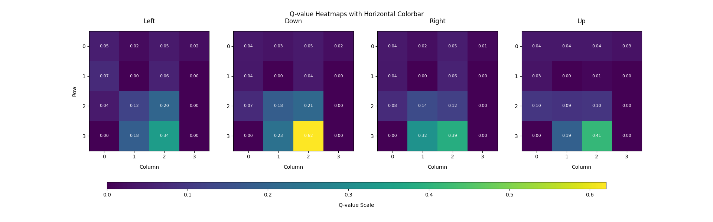
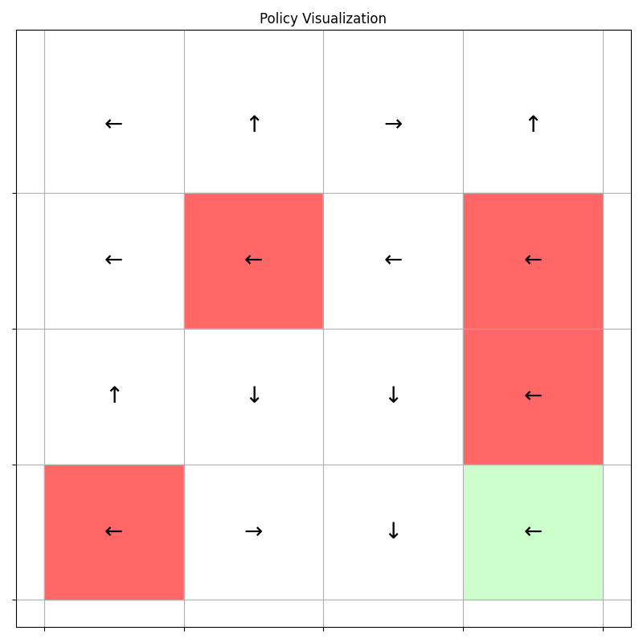
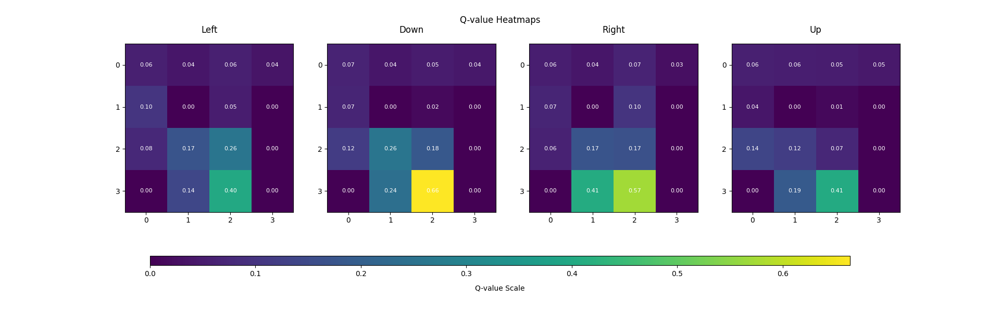

## 一、实验目的
- 掌握时间差分(TD)算法的基本原理与实现
- 掌握两种具体的TD算法：SARSA和Q-learning的基本原理与实现
- 理解SARSA和Q-learning的异同
- 使用这两种算法求解$Gymnasium$库中的$FrozenLake$环境的最优策略并进行可视化
## 二、实验环境
- Python 3.8
- gymnasium
- matplotlib
## 三、实验原理
### 3.1 状态值的时间差分学习
#### 算法简介
该算法所需的数据/经验：
- $(s_0,r_1,s_1,...,s_t,r_{t+1},...)$，按照给定的策略$\pi$生成。

时序差分(TD)学习算法为：$$\begin{align}&v_{t+1}(s_t)=v_t(s_t)-\alpha_t(s_t)[v_t(s_t)-[r_{t+1}+\gamma v_t(s_{t+1})]]\\ &v_{t+1}(s)=v_t(s)\end{align}$$
其中 t = 0, 1, 2, . . .。这里，$v_t(s_t)$ 是 $v_π(s_t) $的估计状态值；$α_t(s_t)$ 是在时刻 $t $状态 $s_t $的学习率。
- 在时刻 $t$，仅更新访问过的状态$ s_t $的价值，而未访问的状态 $s = s_t $的价值保持不变。
- 当上下文明确时，(2) 中的更新将被省略

时序差分算法可以标注如下：
$$\begin{align}
\underbrace{v_{t+1}(s_t)}_{\text{new estimate}} = \underbrace{v_t(s_t)}_{\text{current estimate}} - \alpha_t(s_t)\underbrace{\left[v_t(s_t) - \underbrace{\left[r_{t+1} + \gamma v_t(s_{t+1})\right]}_{\substack{\text{TD target } \bar{v}_t}}\right]}_{\text{TD error } \delta_t}\end{align}
$$
- TD目标 $\bar{v}_t$ 是对 $v_π(s_t)$ 的估计。
$$\bar{v}_t \doteq r_{t+1} + \gamma v(s_{t+1})$$
- TD误差 $\delta_t$ 是对 $v_π(s_t)$ 的估计的偏差。
$$\delta_t \doteq v(s_t) - [r_{t+1} + \gamma v(s_{t+1})] = v(s_t) - \bar{v}_t$$

很明显，新的估计值 $v_{t+1}(s_t)$ 是当前估计值 $v_t(s_t)$ 和 TD 误差的组合。
### 3.2 动作值的时间差分学习 - Sarsa算法
- 上一节介绍的时序差分（TD）算法只能估计状态值。
- 接下来，我们引入Sarsa算法，这是一种可以直接估计动作值的算法。
- 我们还将了解如何使用Sarsa算法找到最优策略。

首先，我们的目标是估计给定策略 \(\pi\) 的动作值。
假设我们有一些经验 \(\{(s_t, a_t, r_{t+1}, s_{t+1}, a_{t+1})\}_t\)，Sarsa算法更新公式为：
\[
q_{t+1}(s_t, a_t) = q_t(s_t, a_t) - \alpha_t(s_t, a_t) \left[q_t(s_t, a_t) - [r_{t+1} + \gamma q_t(s_{t+1}, a_{t+1})]\right]
\]

\[
q_{t+1}(s, a) = q_t(s, a), \quad \forall (s, a) \neq (s_t, a_t)
\]其中t = 0，1，2，...。
- \( q_t(s_t, a_t) \) 是 \( q_\pi(s_t, a_t) \) 的估计值
- \( \alpha_t(s_t, a_t) \) 是依赖于$s_t$和$\alpha_t$的学习率

#### 为什么这个算法被称为Sarsa？
Sarsa是**State-Action-Reward-State-Action**的缩写，因为每一步更新都涉及这五个元素：\((s_t, a_t, r_{t+1}, s_{t+1}, a_{t+1})\)。
> **伪代码：用Sarsa算法进行策略搜索**
> 对于每个幕，执行以下操作：
> - 如果当前状态 $ s_t $ 不是目标状态（终端状态），执行以下操作：
>  - 收集经验 $ (s_t, a_t, r_{t+1}, s_{t+1}, a_{t+1}) $：具体来说，根据 $ \pi_t(s_t) $ 执行动作 $ a_t $，生成 $ r_{t+1} $、$ s_{t+1} $，然后根据 $ \pi_t(s_{t+1}) $ 执行动作 $ a_{t+1} $。
>  - 更新Q值：
    $$
    q_{t+1}(s_t, a_t) = q_t(s_t, a_t) + \alpha_t(s_t, a_t) [r_{t+1} + \gamma q_t(s_{t+1}, a_{t+1}) - q_t(s_t, a_t)]
    $$
>  - 更新策略：
    $$
    \pi_{t+1}(a | s_t) =
    \begin{cases}
      1 - \frac{\epsilon}{|A|}(|A| - 1) & \text{如果 } a = \arg\max_a q_{t+1}(s_t, a) \\
      \frac{\epsilon}{|A|} & \text{否则}
    \end{cases}
    $$
### 3.3 最优动作值的时间差分学习 - Q学习
#### Q学习算法
- 接下来，我们介绍Q - 学习算法，它是应用最为广泛的强化学习算法之一。
- Sarsa算法能够估计给定策略的动作值。为了找到最优策略，它必须与策略改进步骤相结合。
- Q - 学习算法可以直接估计最优动作值，进而得到最优策略。

**Q - 学习算法如下：**
$$ q_{t+1}(s_t, a_t) = q_t(s_t, a_t) - \alpha_t(s_t, a_t) \left[ q_t(s_t, a_t) - \left( r_{t+1} + \gamma \max_{a \in A} q_t(s_{t+1}, a) \right) \right], $$$$ q_{t+1}(s, a) = q_t(s, a), \quad \forall (s, a) \neq (s_t, a_t). $$Q - 学习算法与Sarsa算法非常相似。它们仅在TD目标上有所不同：
- **Q - 学习算法中的TD目标是** $ r_{t+1} + \gamma \max_{a \in A} q_t(s_{t+1}, a) $.
- **Sarsa算法中的TD目标是** $ r_{t+1} + \gamma q_t(s_{t+1}, a_{t+1}) $.

**从数学角度看，Q - 学习算法做了什么？**
它旨在求解：
$$ q(s, a) = \mathbb{E} \left[ R_{t+1} + \gamma \max_a q(S_{t+1}, a) \middle| S_t = s, A_t = a \right], \quad \forall s, a. $$这是用**动作值表示的贝尔曼最优方程**。证明见赵老师的书。
#### Q - 学习算法的实现
由于Q - 学习算法是离轨策略算法，它可以以**离轨策略或同轨策略**的方式实现。
**同轨策略实现：**
>伪代码：用Q - 学习算法进行策略搜索（同轨策略版本）
对于每一幕，执行以下操作：
>如果当前状态 $ s_t $ 不是目标状态，执行以下操作：
>- 收集经验 $(s_t, a_t, r_{t+1}, s_{t+1})$：具体来说，根据 $\pi_t(s_t)$ 采取动作 $a_t$，生成 $r_{t+1}$、$s_{t+1}$。
>- 更新 $q$ 值：
  $$
  q_{t+1}(s_t, a_t) = q_t(s_t, a_t) + \alpha_t(s_t, a_t) \left[ r_{t+1} + \gamma \max_a q_t(s_{t+1}, a) - q_t(s_t, a_t) \right]
  $$
>- 更新策略：
  $$
  \pi_{t+1}(a | s_t) =
  \begin{cases}
  1 - \frac{\epsilon}{|\mathcal{A}|}(|\mathcal{A}| - 1) & \text{如果 } a = \arg\max_a q_{t+1}(s_t, a) \\
  \frac{\epsilon}{|\mathcal{A}|} & \text{否则}
  \end{cases}
  $$

**离轨策略实现：**
>伪代码：用Q - 学习算法搜索最优策略（离轨策略版本）
>对于由πb生成的每个幕{s0, a0, r1, s1, a1, r2, …}，执行以下操作：
>对于幕中的每一步t = 0, 1, 2, …，执行以下操作：
>更新q值：
$$ q_{t+1}(s_t, a_t) = q_t(s_t, a_t) + \alpha_t(s_t, a_t) \left[ r_{t+1} + \gamma \max_a q_t(s_{t+1}, a) - q_t(s_t, a_t) \right] $$更新目标策略：
$$ \pi_{T,t+1}(a|s_t) = \begin{cases} 
1 & \text{如果 } a = \arg\max_a q_{t+1}(s_t, a) \\
0 & \text{否则}
\end{cases} $$

## 四、具体实现
### 4.1 主体框架
```python
import numpy as np
import gymnasium as gym
import matplotlib.pyplot as plt
from tqdm import tqdm
import time
class FrozenLake:
    def __init__(self, env, alpha, gamma, epsilon, num_episodes):
        self.env = env
        self.state_n = self.env.observation_space.n         # 状态空间数量
        self.action_n = self.env.action_space.n             # 动作空间数量
        self.alpha = alpha                                    # 学习率
        self.epsilon = epsilon                                # 探索率
        self.gamma = gamma                                    # 折扣因子
        self.num_episodes = num_episodes                      # 训练轮数
        self.qvalue = np.zeros((self.state_n, self.action_n))      # 初始化Q值函数
    ###根据Q值获取贪婪策略
    def get_greedy_policy(self):
        greedy_policy = np.zeros(self.state_n)
        for i in range(self.state_n):
            greedy_policy[i] = np.argmax(self.qvalue[i])
        return greedy_policy
    ###根据epsilon_greedy策略获取动作
    def epsilon_greedy_action(self, state):
        if np.random.rand() < self.epsilon:
            return np.random.choice(self.action_n)
        else:
            max_actions = np.where(self.qvalue[state] == np.max(self.qvalue[state]))[0]
            return np.random.choice(max_actions)
    ### SARSA算法或者Q-learning算法
    def Sarsa(self):
        ###### 具体实现在下一部分 ######
    ### 测试指定策略的成功率
    def test_policy(self, policy, num_tests=1000):
        success_count = 0
        for _ in range(num_tests):
            state = self.env.reset()[0]
            done = False
            while not done:
                action = policy[state]
                next_state, reward, done, _, _ = self.env.step(action)
                state = next_state
            if reward == 1:  # 成功到达终点
                success_count += 1
        return success_count / num_tests
def plot_q_heatmaps(q_table):
    ### q值热力图可视化部分省略 ###
def visualize_policy_matrix(policy, env):
    ### 策略可视化部分省略 ###
if __name__ == "__main__":
    env = gym.make('FrozenLake-v1', desc=None, map_name="4x4", is_slippery=True)
    alpha = 0.1
    gamma = 0.9
    epsilon = 0.1
    num_episodes = 10000
    # 创建SARSA实例并训练
    sarsa_agent = FrozenLake(env, alpha, gamma, epsilon, num_episodes)
    start_time = time.time()
    sarsa_agent.Sarsa()
    end_time = time.time()

    ### 结果输出与可视化部分省略 ###
```
**贪婪策略生成 get_greedy_policy**
- ​作用​​：根据当前 Q 值表生成贪婪策略，每个状态选择 Q 值最大的动作。

**ε-贪婪动作选择 epsilon_greedy_action**
- ​作用​​：以 epsilon 概率随机选择动作（探索），否则选择当前 Q 值最大的动作（利用）。若多个动作 Q 值相同，则随机选择其中一个。
### 4.2 Sarsa算法实现
```python
    ### SARSA算法
    def Sarsa(self):
        for episode in tqdm(range(self.num_episodes)):
            state = self.env.reset()[0]
            action = self.epsilon_greedy_action(state)
            done = False            ## 终止标志
            while not done:
                # 交互一步
                next_state, reward, done, _, _ = self.env.step(action)
                # 选择下一个动作
                next_action = self.epsilon_greedy_action(next_state)
                # 更新Q值
                td_target = reward + self.gamma * self.qvalue[next_state, next_action]
                td_error = td_target - self.qvalue[state, action]
                self.qvalue[state, action] += self.alpha * td_error
                # 更新状态和动作
                state = next_state
                action = next_action
```
- ​作用​​：使用 SARSA 算法更新 Q 值表。每个 episode 中：
    - 初始化状态和动作。
    - 执行动作，获得下一个状态和奖励。
    - 选择下一个动作（ε-贪婪）。
    - 计算 TD 目标和误差，更新 Q 值。
    - 推进到下一个状态和动作。
- Q 值更新公式：
$$ q_{t+1}(s_t, a_t) = q_t(s_t, a_t) + \alpha_t(s_t, a_t) \left[ r_{t+1} + \gamma q_t(s_{t+1}, a_{t+1}) - q_t(s_t, a_t) \right] $$
- 其中 $q_t(s_t, a_t)$ 是当前 Q 值，$r_{t+1}$ 是奖励，$\gamma$ 是折扣因子，$\alpha_t(s_t, a_t)$ 是学习率。
### 4.3 Q-Learning算法实现
```python
    ### SARSA算法
    ### Qlearning算法
    def Qlearning(self):
        for episode in tqdm(range(self.num_episodes)):
            state = self.env.reset()[0]
            done = False            ## 终止标志
            while not done:
                action = self.epsilon_greedy_action(state)
                # 交互一步
                next_state, reward, done, _, _ = self.env.step(action)
                # 选择下一个动作
                next_action = np.argmax(self.qvalue[next_state])                ### 与SARSA不同的地方
                # 更新Q值
                td_target = reward + self.gamma * self.qvalue[next_state, next_action]
                td_error = td_target - self.qvalue[state, action]
                self.qvalue[state, action] += self.alpha * td_error
                # 更新状态
                state = next_state
```
- ​作用​​：使用 Q-Learning 算法更新 Q 值表。每个 episode 中：
    - 初始化状态。
    - 执行动作，获得下一个状态和奖励。
    - 选择下一个动作（ε-贪婪）。
    - 计算 TD 目标和误差，更新 Q 值。
    - 推进到下一个状态。
- Q 值更新公式：
$$ q_{t+1}(s_t, a_t) = q_t(s_t, a_t) + \alpha_t(s_t, a_t) \left[ r_{t+1} + \gamma \max_a q_t(s_{t+1}, a) - q_t(s_t, a_t) \right] $$
- 其中 $q_t(s_t, a_t)$ 是当前 Q 值，$r_{t+1}$ 是奖励，$\gamma$ 是折扣因子，$\alpha_t(s_t, a_t)$ 是学习率。
## 五、实验结果
### 5.0 训练参数
- 训练轮数：$40000$
- 学习率：$\alpha=0.1$
- 折扣因子：$\gamma=0.9$
- 探索率：$\epsilon=0.1$
- 测试轮数：$1000$
### 5.1 Sarsa算法结果展示
#### Sarsa算法最优策略q值热力图

#### Sarsa算法最优策略可视化

#### Sarsa算法训练效率与成功率
##### Sarsa算法训练40000次所消耗的时间
$$80.70s$$
##### Sarsa算法得到的最优策略测试1000次的成功率
$$61.60\%$$
### 5.2 Q-learning算法结果展示
#### Q-learning算法最优策略q值热力图

#### Q-learning算法最优策略可视化

#### Q-learning算法训练效率与成功率
##### Q-learning算法训练40000次所消耗的时间
$$85.05s$$
##### Q-learning算法得到的最优策略测试1000次的成功率
$$45.20\%$$
### 5.3 蒙特卡洛算法、Sarsa算法与Q-learning算法的比较
|算法|最优策略|训练时间|正确率|
|---|---|---|---|
|MC_on_policy||$73.62s$|$58.70\%$|
|MC_off_policy||$34.74s$|$14.60\%$|
|Sarsa||$80.70s$|$61.60\%$|
|Q-Learning||$85.05s$|$45.20\%$|

分析以上结果可以发现，Sarsa算法和Q-learning算法的训练时间要长于蒙特卡洛算法，但同时其正确率也要更高。

## 六、总结与综合分析
### 6.1 算法性能对比分析
从实验结果可以看出，SARSA算法在FrozenLake环境中的测试成功率（61.60%）显著高于Q-learning（45.20%），而训练时间两者相近（80.70s vs 85.05s）。蒙特卡洛同轨策略（MC_on_policy）的正确率（58.70%）接近SARSA，但离轨策略（MC_off_policy）正确率极低（14.60%）。这说明：
#### 环境动态的影响​
FrozenLake环境具有随机转移特性（is_slippery=True），导致动作执行结果不确定。SARSA通过​​在线策略更新​​（使用ε-greedy策略选择下一步动作），更贴合实际环境动态，生成的策略更保守安全；而Q-learning通过​​离线策略更新​​（直接选择最大Q值动作），过度理想化下一步动作，容易在随机性环境中高估动作价值，导致策略过于冒险。
#### ​探索与利用的平衡​​
SARSA在更新时同时考虑当前策略的探索性（如ε-greedy选择下一步动作），其TD目标包含环境随机性，生成的策略更鲁棒；Q-learning的max操作隐含了完全贪心的假设，忽略了实际动作选择的随机性，导致策略在测试时因环境不确定性频繁失败。
#### ​蒙特卡洛方法的局限性​​
蒙特卡洛离轨策略因重要性采样问题导致方差过大，难以收敛；而同轨策略依赖完整轨迹的回报均值化更新，虽然稳定性较高，但样本效率低于时间差分方法，训练时间反而较短（73.62s）可能与幕终止较快或实现优化有关。

### 6.2 SARSA与Q-learning的核心区别
#### 更新目标的本质差异
- **​SARSA​​：**
TD目标为$$r_{t+1} + \gamma q_t(s_{t+1}, a_{t+1})$$通过当前策略（ε-greedy）选择。
→ 更新方向与当前策略的动作选择一致，体现​​在线策略学习​​特性。
- **​Q-learning​​：**
TD目标为$$r_{t+1} + \gamma \max_a q_t(s_{t+1}, a) $$直接使用最优动作的Q值。
→ 更新方向独立于当前策略，体现​​离线策略学习​​特性。
#### 策略探索方式的差异
​​SARSA​​更注重​​安全性​​，在训练过程中通过ε-greedy探索，生成的策略会主动避开可能导致随机失败的区域（如靠近冰洞的状态）。
​​Q-learning​​更注重​​最优性​​，倾向于选择理论最优路径（如最短路径），但因忽略环境随机性，实际测试时容易因滑动掉入冰洞。
#### 适用场景对比
|算法|适用场景|	局限性|
|---|---|---|
|​SARSA|​高随机性环境（如FrozenLake）|可能收敛到局部保守策略|
|​​Q-learning|​​确定性环境或低随机性任务（如CliffWalking）|对随机性敏感，易高估动作值|
### 6.3 结论
本实验验证了时间差分算法在随机环境中的有效性。SARSA因其在线策略特性，在FrozenLake环境中表现更优；Q-learning因离线策略的max偏差问题，正确率较低。结果表明，算法选择需紧密结合环境动态特性——在强调安全性的随机任务中，SARSA更具优势；在确定性任务中，Q-learning能更快逼近最优策略。后续研究可通过混合算法或改进探索机制进一步提升性能。