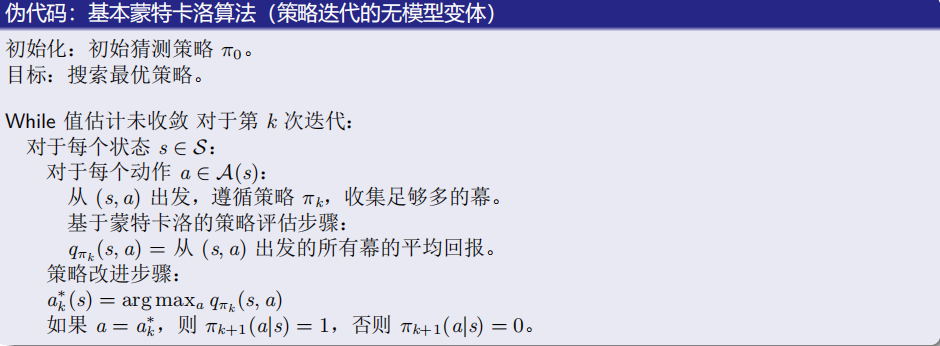
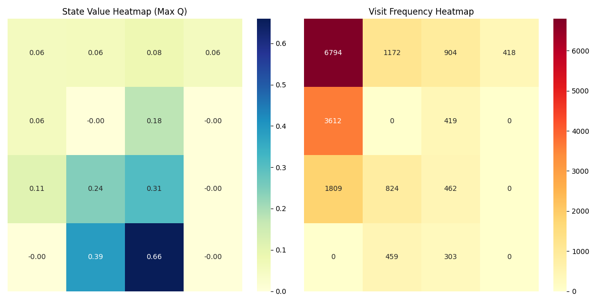
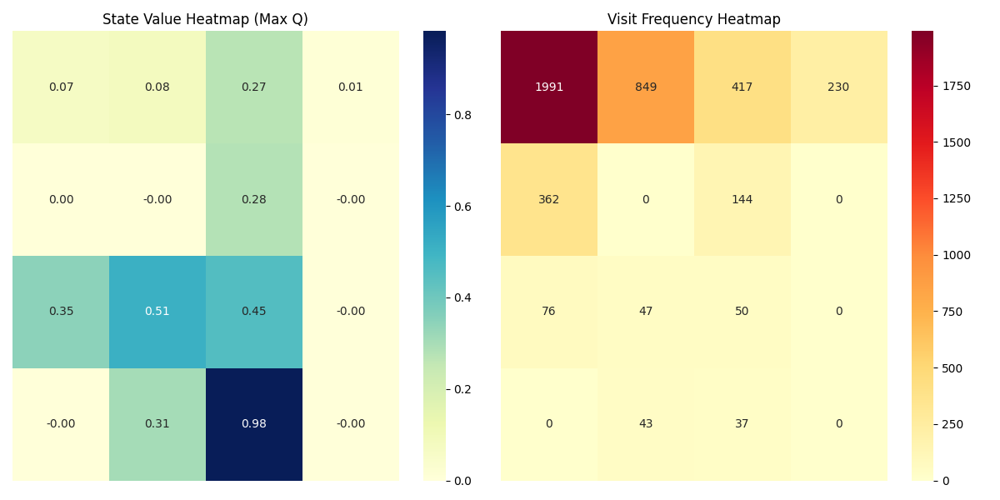
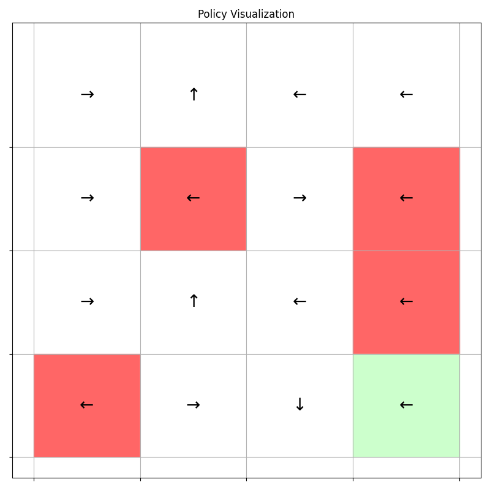

### <center> 强化学习实验第四次实验报告
##### <center>智能科学与技术 2213530 张禹豪
#### 一、实验目的
- 了解$on-policy$和$off-policy$两种蒙特卡洛算法的原理与区别
- 使用这两种算法求解$Gymnasium$库中的$FrozenLake$环境的最优策略
#### 二、实验环境
- Python 3.8
- gymnasium
- matplotlib
#### 三、实验原理
##### 3.1 蒙特卡洛算法（Monte Carlo）
&emsp;&emsp;蒙特卡洛算法是一种基于经验的学习算法，它通过对环境进行多次随机采样，来估计状态值函数或动作值函数。蒙特卡洛算法的主要特点是不需要环境的模型，只需要与环境进行交互即可。
##### 3.2 基本的蒙特卡洛算法描述
给定一个初始策略$\pi_0$，在第$k$次迭代中有以下两个步骤：
- 步骤1：**策略评估**。此步骤是为了得到所有状态-动作对$(s,a)$对应的$q_{\pi_k}(s,a)$。具体来说，对于每个状态-动作对$(s,a)$，运行无限多个（或足够多）幕。这些幕回报的平均值用于近似$q_{\pi_k}(s,a)$。
- 步骤2：**策略改进**。此步骤是为了对所有$s\in S$求解$\pi_{k+1}(s)=argmax_\pi\sum_a\pi(a|s)q_{\pi_k}(s,a)$。贪婪最优策略是$\pi_{k+1}(a^*_k|s)=1$，其中$a^*_k=argmax_aq_{\pi_k}(s,a)$。
与策略迭代算法完全相同，除了
- 直接估计$q_{\pi_k}(s,a)$，而不是求解$v_{\pi_k}(s)$。
##### 3.3 基本的蒙特卡洛算法伪代码

##### 3.4 $On-policy$
&emsp;&emsp;$On-policy$是指在策略评估和策略改进时使用相同的策略。在$On-policy$中，我们使用$\epsilon-greedy$策略来进行策略评估和策略改进。
- 算法类型：基于策略的蒙特卡洛方法(On-policy Monte Carlo)

- 算法步骤：
  - 1.**策略生成**：使用当前策略（如ε−greedy）与环境交互，生成完整轨迹。
  - 2.**值函数估计**：对每个状态-动作对记录首次访问的累积回报，计算平均值作为Q值估计。更新公式为：$$Q(s,a)=Q(s,a)+\alpha[G_t-Q(s,a)]$$
  - 3.**策略改进**：根据当前Q值，贪婪地更新策略，逐步减少ε以减少探索性。
- 特点：
  - 策略和采样策略是同一个（即目标策略 = 采样策略）。
  - 适用于策略改进和评估的循环过程。
  - 通过epsilon动态调整探索程度
##### 3.5 $Off-policy$
&emsp;&emsp;$Off-policy$是指在策略评估和策略改进时使用不同的策略。在$Off-policy$中，我们使用$\epsilon-greedy$策略来进行策略评估，使用贪婪策略来进行策略改进。
- 算法类型：基于采样策略的蒙特卡洛方法（Off-Policy MC）。

- 算法步骤：
    - 1.**数据生成**：使用行为策略（如随机策略）生成轨迹数据。
    - 2.**重要性采样**：通过重要性采样率$W_t=\prod^{t-1}_{k=0}\frac{\pi(\alpha_k|s_k)}{b(\alpha_k|s_k)}$调整回报，将行为策略数据转换为对目标策略（如贪婪策略）的估计。更新公式为：$$Q(s,a)=Q(s,a)+\alpha W_t[G_t-Q(s,a)]$$
    - 3.**值函数更新**：基于调整后的回报，更新Q值，逐步优化。
- 特点：
  - 允许目标策略和采样策略不同，适用于离线数据或复杂策略.
  - 需要计算重要性采样权重（W），增加了计算复杂度。
#### 四、代码解析
##### 4.1 $On-policy$蒙特卡洛算法
**策略相关方法详解**
###### `update_policy()`纯贪婪策略更新
```python
def update_policy(self):
    for i in range(16):  # 遍历所有状态
        self.Pi[i,:] = 0  # 清零当前策略
        max_num = np.argmax(self.qvalue[i,:])  # 找到Q值最大的动作
        self.Pi[i, max_num] = 1  # 确定性策略
```
- 功能：将策略变为纯贪婪策略
- 逻辑：
    - 对每个状态，先清零所有动作概率
    - 选择当前Q值最大的动作
    - 将该动作概率设为1（其他为0）
###### `update_epsilon_greedy()` ε-greedy策略更新
```python
def update_epsilon_greedy(self):
    for i in range(16):
        self.Pi[i,:] = self.epsilon/4  # 基础探索概率
        max_num = np.argmax(self.qvalue[i,:])
        self.Pi[i, max_num] += (1-self.epsilon)  # 增加利用概率
```
- 平衡探索与利用：
  - 所有动作至少有ε/4的概率
  - 最优动作额外获得(1-ε)的概率

**蒙特卡洛学习主循环详解**
###### 完整代码结构
```python
def MC_learning(self):
    num = 0
    while num < 6000:  # 总迭代次数控制
        # 1. 生成episode
        # 2. 反向计算回报
        # 3. 更新Q值
        # 4. 定期策略更新
        num += 1
```
######  Episode生成阶段
```python
state_traj, action_traj, reward_traj = [], [], []
self.cur_state, _ = self.env.reset()
done = False

while not done and episode_num < 200:  # 最大步数限制
    action = self.sample_action(self.cur_state)  # 按当前策略采样动作
    next_state, reward, done = self.step(action)
    # 存储轨迹
    state_traj.append(self.cur_state)
    action_traj.append(action)
    reward_traj.append(reward)
    self.cur_state = next_state
    episode_num += 1
```
- 逻辑：
  - 重置环境，开始新的episode
  - 按当前策略采样动作
  - 执行动作，记录状态、动作、回报
  - 直到episode结束或达到最大步数
- 关键点：
  - `sample_action()`根据当前策略的概率分布选择动作
  - 存储完整的`(s,a,r)`序列用于后续计算
  - 设置200步限制防止无限循环
######  回报计算与Q值更新
```python
G = 0  # 累计回报
for i in reversed(range(len(state_traj))):  # 反向遍历
    G = G * self.gamma + reward_traj[i]  # 折扣累计
    
    # 增量式更新
    self.n[state_traj[i], action_traj[i]] += 1
    alpha = 1/self.n[state_traj[i], action_traj[i]]  # 动态学习率
    self.qvalue[state_traj[i], action_traj[i]] += \
        alpha * (G - self.qvalue[state_traj[i], action_traj[i]])
```
- 逻辑：
  - 从最终状态开始，逐步计算回报
  - 采用增量式更新Q值
  - 动态调整学习率
- 关键点：
  - `reversed()`反向遍历序列：反向计算可以高效复用子问题的解
  - 动态学习率：$α=1/N(s,a)$：保证收敛性
- 数学原理：
  - 回报计算：$G_t = R_{t+1} + \gamma G_{t+1}$
  - $Q(s,a) = Q(s,a) + α(G - Q(s,a))$
######  策略更新逻辑
```python
if num % 2001 == 0:  # 定期更新
    self.update_epsilon_greedy()
    self.epsilon *= 0.9  # 探索率衰减
    self.n = np.zeros((16, 4))  # 重置计数器
```
- 逻辑：
  - 每2000次迭代更新一次策略
  - ε-greedy策略更新
  - ε衰减：逐步减少探索性
  - 重置计数器：保证学习率动态性

##### 4.2 $Off-policy$蒙特卡洛算法
**核心改进与策略特性**
###### 双策略机制
```python
self.behaviour_Pi = 0.25 * np.ones((16, 4))  # 行为策略（采样用）
self.target_Pi = np.zeros((16, 4))           # 目标策略（优化目标）
```
- **行为策略(Behaviour Policy)：**用于与环境交互生成轨迹（ε-greedy）
- **目标策略(Target Policy)：**通过重要性采样逐步逼近的最优策略（更贪婪）
###### 重要性采样
```python
W = 1  # 重要性权重
for i in reversed(...):
    W *= self.target_Pi[s,a] / self.behaviour_Pi[s,a]  # 权重累积
    self.qvalue[s,a] += (W/C[s,a]) * (G - self.qvalue[s,a])
```
- 逻辑：
  - 通过重要性权重调整回报
  - 使行为策略数据逼近目标策略数据
- 数学原理：
  - 通过权重修正行为策略与目标策略的概率差异：
$$W_t = \prod^{t-1}_{k=0}\frac{\pi(\alpha_k|s_k)}{b(\alpha_k|s_k)}$$

**关键方法详解**
###### 策略更新方法
```python
def update_target_policy(self):
    epsilon = self.epsilon/10  # 目标策略更贪婪
    for i in range(16):
        self.target_Pi[i,:] = epsilon/4
        max_num = np.argmax(self.qvalue[i,:])
        self.target_Pi[i, max_num] += (1-epsilon)

def update_behaviour_policy(self):
    for i in range(16):
        self.behaviour_Pi[i,:] = self.epsilon/4
        max_num = np.argmax(self.qvalue[i,:])
        self.behaviour_Pi[i, max_num] += (1-self.epsilon)
```
- 区别：
  - 目标策略的ε更小，更偏向利用
  - 行为策略保持ε-greedy：保证探索性
###### Off-policy蒙特卡洛主循环
```python
def Off_MC_learning(self):
    while num < 6000:
        # 生成轨迹（使用行为策略）
        while not done:
            action = self.sample_action(state)  # 从behaviour_Pi采样
            ...
        
        # 反向更新（考虑重要性权重）
        W = 1
        for i in reversed(...):
            self.C[s,a] += W
            self.qvalue[s,a] += (W/C[s,a])*(G - self.qvalue[s,a])
            W *= target_Pi[s,a]/behaviour_Pi[s,a]  # 关键步骤
```
- 逻辑：
    - 用行为策略生成完整轨迹
    - 反向计算累计回报G
    - 通过重要性权重W修正更新量
    - 动态调整学习率W/C[s,a]
#### 五、实验结果展示
##### 5.0 GYM环境介绍
- **FrozenLake-v0**
&emsp;&emsp;FrozenLake是一个简单的环境，它是一个4x4的网格，其中有一个起点S和一个终点G。冰块上有一些洞，掉进洞里就失败了。在冰面可能会滑动，所以有时候并不是玩家想要的方向。玩家的任务是找到一条路径，从起点S到终点G。环境如下所示：

##### 5.1 $On-policy$蒙特卡洛算法
- **初始策略**：
```bash
初始策略: [[0.25 0.25 0.25 0.25]
 [0.25 0.25 0.25 0.25]
 [0.25 0.25 0.25 0.25]
 [0.25 0.25 0.25 0.25]
 [0.25 0.25 0.25 0.25]
 [0.25 0.25 0.25 0.25]
 [0.25 0.25 0.25 0.25]
 [0.25 0.25 0.25 0.25]
 [0.25 0.25 0.25 0.25]
 [0.25 0.25 0.25 0.25]
 [0.25 0.25 0.25 0.25]
 [0.25 0.25 0.25 0.25]
 [0.25 0.25 0.25 0.25]
 [0.25 0.25 0.25 0.25]
 [0.25 0.25 0.25 0.25]
 [0.25 0.25 0.25 0.25]]
```
- **最终策略**：
```bash
最终策略:
 [[0.66 0.11 0.11 0.11]
 [0.11 0.11 0.11 0.66]
 [0.11 0.11 0.66 0.11]
 [0.11 0.66 0.11 0.11]
 [0.11 0.66 0.11 0.11]
 [0.66 0.11 0.11 0.11]
 [0.11 0.11 0.66 0.11]
 [0.66 0.11 0.11 0.11]
 [0.11 0.11 0.11 0.66]
 [0.11 0.66 0.11 0.11]
 [0.66 0.11 0.11 0.11]
 [0.66 0.11 0.11 0.11]
 [0.66 0.11 0.11 0.11]
 [0.11 0.11 0.66 0.11]
 [0.11 0.11 0.11 0.66]
 [0.66 0.11 0.11 0.11]]
```
- **当前Q值与访问频次热力图**：

- **最优策略图示**：

##### 5.2 $Off-policy$蒙特卡洛算法
- **贪婪策略**：
```bash
贪婪策略:
 [[0. 0. 1. 0.]
 [0. 0. 0. 1.]
 [1. 0. 0. 0.]
 [1. 0. 0. 0.]
 [0. 0. 1. 0.]
 [1. 0. 0. 0.]
 [0. 0. 1. 0.]
 [1. 0. 0. 0.]
 [0. 0. 1. 0.]
 [0. 0. 0. 1.]
 [1. 0. 0. 0.]
 [1. 0. 0. 0.]
 [1. 0. 0. 0.]
 [0. 0. 1. 0.]
 [0. 1. 0. 0.]
 [1. 0. 0. 0.]]
```
- **当前Q值与访问频次热力图**：

- **最优策略图示**：

##### 5.3 两种算法结果比较
- **运行时间**

||On-Policy|Off-Policy|
|---|---|---|
|时间(s)|5.87|5.67|

分析：on-policy可能需要更多样本才能收敛，因为每次策略更新后都需要新的数据，但是其稳定性更高；off-policy可以更好地利用历史数据，但是需要计算重要性采样权重，增加了计算复杂度，因此两者运行时间相差不大。
- **最优策略成功率**

||On-Policy|Off-Policy|
|---|---|---|
|成功率(1000次)|18.4%|6.20%|

分析：on-policy的成功率更高，说明其相对容易收敛到最优策略；off-policy的成功率较低，说明其更容易陷入局部最优解，学习过程不太稳定。

#### 六、实验对比分析
- **两种算法对比**

|算法类型	|On-Policy MC	|Off-Policy MC	|
|---|---|---|
|策略类型|	目标策略 = 采样策略	|目标策略 ≠ 采样策略	|
|策略更新	|ε-贪婪策略|	贪婪策略（目标）+ ε-贪婪策略（采样）|	
|轨迹采样	|根据当前策略采样	|根据采样策略采样	|
|值函数更新|	增量式更新	|增量式更新 + 重要性采样权重修正	|
|探索机制	|动态调整 ε	|动态调整 ε	|
|适用场景|	在线学习，策略改进|	离线学习，复杂策略	|

- **适用场景**
**on_policy**适用于需要在线学习的场景，策略和采样策略一致，适合简单的强化学习任务。
**off_policy**适用于离线数据或复杂策略的场景，目标策略和采样策略可以不同，灵活性更高。  
- **与策略迭代算法的区别**
&emsp;&emsp;蒙特卡洛算法与策略迭代算法的区别在于：
  - **策略评估**：蒙特卡洛算法通过采样轨迹估计值函数，而策略迭代算法通过迭代更新值函数。
  - **策略改进**：蒙特卡洛算法通过贪婪策略更新策略，而策略迭代算法通过迭代更新策略。
  - **收敛性**：蒙特卡洛算法更容易陷入局部最优解，但是收敛速度更快；策略迭代算法更稳定，但是收敛速度较慢。

&emsp;&emsp;蒙特卡洛方法是在解空间中采样，提高估计水平，来优化策略，但每次采样的作用不一定是积极的或有作用的。迭代方法注重值函数的收敛，除了策略迭代的初始策略具有随机性以外，一直向最优（可能是局部最优）收敛。然而，虽然蒙特卡洛方法的效率较差，但是它是一种不需要预知模型，即状态转移率的方法，其可用范围更加宽广。在迭代方法不适用的情况下，蒙特卡洛方法也具有着较高的可行性。

#### 七、总结
&emsp;&emsp;on-policy和off-policy都是蒙特卡洛算法的变种，on-policy更稳定，但是收敛速度较慢，off-policy更灵活，但是需要计算重要性采样权重，增加了计算复杂度。在实际应用中，需要根据具体任务的特点选择合适的算法。