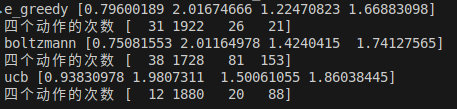
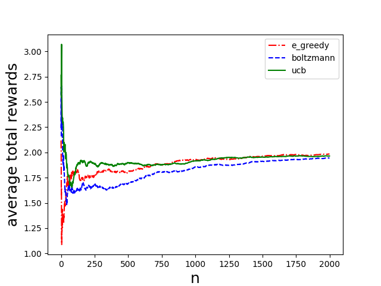
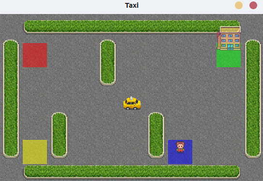

## <center>强化学习实验第二次实验报告
#### <center> 2213530 张禹豪 智能科学与技术
#### 一、实验要求
- 将多臂赌博机的3个动作改为4个动作，并用三种探索-利用平衡策略进行学习。
- 选择一个gym环境, 构建它的状态转移模型、回报模型, 写出代码对应的MDP元素（S,A,P,R,gamma）。

#### 二、多臂赌博机动作添加
#### 代码修改
&emsp;&emsp;为了将多臂赌博机的动作数量从3个增加到4个，我们需要对原有的代码进行修改。具体的修改如下：
- **`def __init__(self, *args, **kwargs):`**
  - `self.q = np.array([0.0, 0.0, 0.0, 0.0])`
  - `self.action_counts = np.array([0,0,0,0])`
  - `self.actions = [1, 2, 3, 4]`
  - `self.actions_num = np.array([0, 0, 0, 0])`

&emsp;&emsp;在初始化函数中，我们需要将原有的`self.q`、`self.action_counts`、`self.actions`和`self.actions_num`分别改为4个元素的数组，以适应4个动作的情况。
- **`def reset(self):`**
    - `self.q = np.array([0.0, 0.0, 0.0, 0.0])`
    - `self.action_counts = np.array([0, 0, 0, 0])`
    - `self.actions_num=np.array([0,0,0,0])`

&emsp;&emsp;在重置函数中，我们需要将原有的`self.q`、`self.action_counts`和`self.actions_num`分别改为4个元素的数组，以适应4个动作的情况。
- **`def choose_action(self, policy, **kwargs):`**
    - `action = np.random.randint(1,5)`
    - `action = np.random.choice([1,2,3,4], p = p.rave())# 根据p的概率随机选择动作`

&emsp;&emsp;在选择动作函数中，我们需要修改原有的动作选择的范围`，以适应4个动作的情况。

- **`def step():`**
```python
if a == 4:
    r = np.random.normal(1.8,1)
```
&emsp;&emsp;在step函数中，我们增添了对动作4的奖励设置，使得动作4的奖励服从均值为1.8，方差为1的正态分布。
- **`def train(self, play_total, policy, **kwargs):`**
    - `reward_4 = []`

&emsp;&emsp;首先在train函数中增加了一个列表`reward_4`，用于存储动作4的奖励。
```python
for i in range(play_total):
    .......................................
            if action == 4:
                self.actions_num[3] += 1
    .......................................
            reward_4.append([self.q[3]])
```
&emsp;&emsp;在训练函数中，我们增添了对于选取动作4次数的存储和对应的奖励存储。
#### 结果展示


&emsp;&emsp;观察结果可见，所有动作最后的奖励结果均值同我们的预先设定相近，说明我们的代码修改是正确的。
#### 三、构建选定gym环境的马尔可夫链模型
#### **环境选择**：Taxi-v3
##### 该TaxiEnv对应的马尔可夫决策过程（MDP）元素如下：
#### &emsp;&emsp;状态空间（S）
- **定义**：由四个分量组成 (taxi_row, taxi_col, pass_loc, dest_idx)：
> **`taxi_row, taxi_col`**：出租车在5x5网格中的行和列（取值0-4）。
> **`pass_loc`**：乘客位置，取值0-4（0-3表示四个初始位置，4表示乘客在车上）。
> **`dest_idx`**：目的地位置，取值0-3（对应四个颜色）。
> 编码方式：状态通过公式 **`encode()`** 转换为整数，共有 $5*5*5*4 = 500$ 种可能，但实际可达状态为404个（排除无效状态）。

&emsp;&emsp;状态空间的可视化如下：
```python
MAP = [
    "+---------+",
    "|R: | : :G|",
    "| : | : : |",
    "| : : : : |",
    "| | : | : |",
    "|Y| : |B: |",
    "+---------+",
]     # 地图如上述所示，其中R、G、Y、B分别代表四个目的地，|和-代表墙壁，:代表可移动路径
WINDOW_SIZE = (550, 350)
```


#### &emsp;&emsp;动作空间（A）
- 动作集合：{0, 1, 2, 3, 4, 5}，分别对应：
>   0：向南移动（向下）
    1：向北移动（向上）
    2：向东移动（向右）
    3：向西移动（向左）
    4：接乘客（Pickup）
    5：下乘客（Dropoff）

#### &emsp;&emsp;状态转移概率模型（P）
- **确定性转移**：每个状态-动作对`(s, a)`对应唯一的下一状态`s'`，概率为1.0。

状态转移函数`P`的实现如下：
```python
self.P = {
    state: {action: [] for action in range(num_actions)}
    for state in range(num_states)
}
for row in range(num_rows):
    for col in range(num_columns):
        for pass_idx in range(len(locs) + 1):  # +1 for being inside taxi
            for dest_idx in range(len(locs)):
                state = self.encode(row, col, pass_idx, dest_idx)
                if pass_idx < 4 and pass_idx != dest_idx:
                    self.initial_state_distrib[state] += 1
                for action in range(num_actions):
                    # defaults
                    new_row, new_col, new_pass_idx = row, col, pass_idx
                    reward = (
                        -1
                    )  # 默认的每步奖励为-1，若有特殊情况则在下面的代码中进行修改
                    terminated = False
                    taxi_loc = (row, col)
            .........................................(具体状态转移代码如下)
                    self.P[state][action].append(
                        (1.0, new_state, reward, terminated)
                    )
```
- **转移规则**：由上述代码所规定的转移规则如下：
  - *移动动作（0-3）* ：根据地图中的墙壁（|和-）和是否超过地图边界判断是否允许移动。若撞墙或超过地图边界，则位置不变。否则对应方向移动。
>```python
># 当action = 0时，向下移动且使用min函数防止超出边界
>if action == 0:
>    new_row = min(row + 1, max_row)  
># 当action = 1时，向上移动且使用max函数防止超出边界
>elif action == 1:
>    new_row = max(row - 1, 0)  
># 当action = 2且不会碰到墙壁"|"时，向右移动且使用min函数防止超出边界
>if action == 2 and self.desc[1 + row, 2 * col + 2] == b":":
>    new_col = min(col + 1, max_col)  
># 当action = 3且不会碰到墙壁"|"时，向左移动且使用max函数防止超出边界
>elif action == 3 and self.desc[1 + row, 2 * col] == b":":  
>    new_col = max(col - 1, 0)  
>```

- 
  - *接乘客动作（4）* ：车位置与乘客位置重合且乘客不在车上则接乘客，否则奖励-10。

> ```python
> elif action == 4:  # pickup
>    # 出租车位置与乘客位置重合且乘客不在车上则接乘客
>    if pass_idx < 4 and taxi_loc == locs[pass_idx]: 
>        new_pass_idx = 4
>    # 若乘客不在当前位置并接客或者乘客处于车上并接客则奖励-10
>    else:  
>        reward = -10
>```

-
  - *下乘客动作（5）* ： 若乘客在车上且目的地正确，则奖励20，任务结束并更新乘客位置为目的地；若乘客在车上但目的地错误则更新乘客位置为当前位置；若乘客不在车上或者在非法位置下客则奖励-10。
>```python
> elif action == 5:  # dropoff
>    # 乘客在车上且目的地正确则奖励20并更新乘客位置为目的地
>    if (taxi_loc == locs[dest_idx]) and pass_idx == 4: 
>        new_pass_idx = dest_idx
>        terminated = True
>        reward = 20
>    # 乘客在车上但目的地错误则更新乘客位置为当前位置
>    elif (taxi_loc in locs) and pass_idx == 4: 
>        new_pass_idx = locs.index(taxi_loc)
>    # 若乘客不在车上或者在非法位置下客则奖励-10
>    else:  
>        reward = -10
> ```

#### &emsp;&emsp;奖励函数 (R)
- **规则**：
  - **默认奖励**：每步-1（时间惩罚）
  - **成功下客**：+20（覆盖默认奖励）。
  - **非法接送**：-10（覆盖默认奖励）。
- **数学表示**：
$$ R(s,a)=\left\{
\begin{aligned}
20 &&成功下课（动作5且正确位置） \\
-10 &&非法接送（动作4或5的条件不满足） \\
-1 &&其他情况（移动或合法接送）
\end{aligned}
\right.
$$&emsp;&emsp;奖励函数的实现代码已经在状态转移概率模型中给出，在每步对应的动作之后已经给出相应的奖励。
#### &emsp;&emsp;折扣因子 (γ)
&emsp;&emsp;在该MDP环境中折扣因子$\gamma=1$，因为任务在成功下客后终止，是一个有限的马尔可夫决策过程，不存在无限时间的问题。
#### &emsp;&emsp;MDP元素总结
| 元素 | 描述 |
|---|---|
|S|500种编码状态（实际404种可达）|
|A|6种离散动作|
|P|确定性转移|
|R|根据动作结果返回 +20, -10, 或 -1|
|$\gamma$|1.0|

#### &emsp;&emsp;重要代码补充介绍
```python
def encode(self, taxi_row, taxi_col, pass_loc, dest_idx):
    """将四个状态参数编码为唯一整数"""
    i = taxi_row
    i = i * 5 + taxi_col
    i = i * 5 + pass_loc
    i = i * 4 + dest_idx
    return i
def decode(self, i):
    """将整数解码回四个状态参数"""
    dest_idx = i % 4
    i = i // 4
    pass_loc = i % 5
    i = i // 5
    taxi_col = i % 5
    i = i // 5
    taxi_row = i
    return (taxi_row, taxi_col, pass_loc, dest_idx)
```
&emsp;&emsp;上述代码中的`encode`和`decode`函数用于将状态编码为整数和将整数解码为状态，方便状态空间的处理。状态编码公式：$$i = taxi\_row*5^3 + taxi\_col*5^2 + pass\_loc*5 + dest\_idx$$
```python
def action_mask(self, state: int):
    """生成可用动作掩码（1表示可用）"""
    mask = np.zeros(6, dtype=np.int8)
    taxi_row, taxi_col, pass_loc, dest_idx = self.decode(state)
    
    # 检查各方向移动可能性
    if taxi_row < 4: mask[0] = 1  # 可南移
    if taxi_row > 0: mask[1] = 1  # 可北移
    # 检查东西方向是否有墙
    if taxi_col < 4 and self.desc[1+taxi_row, 2*taxi_col+2] == b":": mask[2] = 1
    if taxi_col > 0 and self.desc[1+taxi_row, 2*taxi_col] == b":": mask[3] = 1
    # 检查接送条件
    if pass_loc < 4 and (taxi_row, taxi_col) == self.locs[pass_loc]:
        mask[4] = 1  # 可以接客
    if pass_loc == 4 and ((taxi_row, taxi_col) == self.locs[dest_idx] or 
                            (taxi_row, taxi_col) in self.locs):
        mask[5] = 1  # 可以下客
    return mask
```
&emsp;&emsp;上述代码中的`action_mask`函数用于动态计算每个状态下哪些动作有效，生成动作掩码，标记合法动作（1有效，0无效）。，防止非法移动（如撞墙）或无效接送操作
```python
def step(self, a):
    """执行动作，返回新状态、奖励、终止标志等"""
    transitions = self.P[self.s][a]  # 获取可能的转移
    # 选择转移（这里只有确定性转移）
    i = categorical_sample([t[0] for t in transitions], self.np_random)
    p, s, r, t = transitions[i]
    self.s = s  # 更新当前状态
    self.lastaction = a  # 记录最后动作
```
- **流程**：
    - 从转移字典 `self.P` 中获取当前状态和动作的转移列表。
    - 使用 `categorical_sample` 根据概率选择转移结果。
    - 更新状态、记录动作、返回结果。