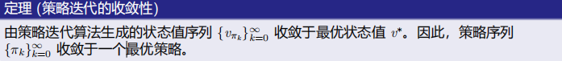
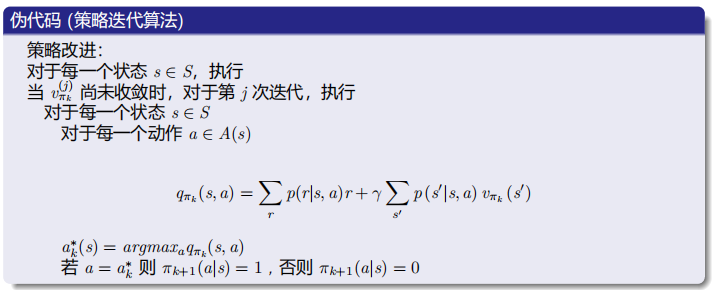
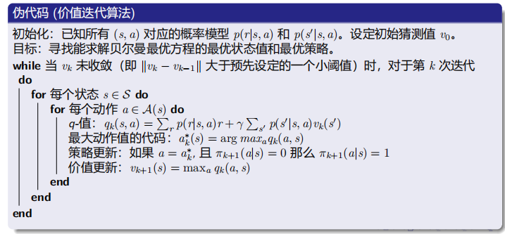
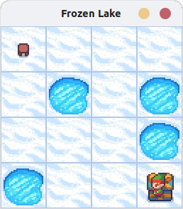
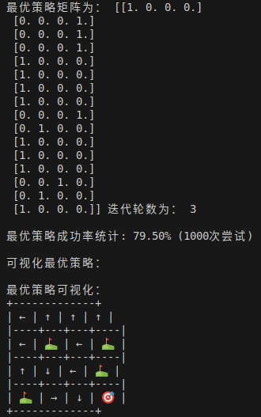
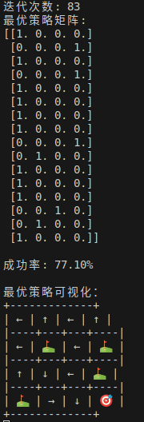

### <center> 强化学习实验第三次实验报告
##### <center>智能科学与技术 2213530 张禹豪
#### 一、实验要求
- 使用策略迭代和值迭代算法分别求解任意一个Gym环境的最优策略
#### 二、实验环境
- Python 3.8
- gymnasium
#### 三、实验原理
#### 策略迭代
##### （1）概念
&emsp;&emsp;策略迭代法是通过两步学习最优策略。第一步：初始化一个策略（比如随机选取策略），计算该策略的值函数，称作策略评估；第二步：根据得到的值函数设置新的策略，称作策略改进。如此一直反复迭代，直到收敛，得到最优策略。
##### （2）流程
- **策略评估**：
&emsp;&emsp;用某种策略（比如随机选取动作），通过迭代法，计算该问题的各个状态的状态价值 $V^\pi(s)$。当然当前的这个策略未必是最优的，得到的状态值也未必理想，但它就是当前这个策略的评估结果。迭代公式是贝尔曼方程：$$
V^\pi(s)=E_aE_s[R(s,a,s')+\gamma V^\pi(s')$$&emsp;&emsp;得到的各个状态值可用一个表格来表示。
- **策略改进**：
&emsp;&emsp;对上面得到的价值表，通过迭代，求出各个状态s各个动作a的动作值函数值$Q^\pi(s,a)$。
&emsp;&emsp;迭代公式为：$$Q^\pi(s,a)=E_{s'}[R(s,a,s')+\gamma V^\pi (s')]$$&emsp;&emsp;然后用得到的改进策略。即对于每个状态s，选择使得$Q^\pi(s,a)$最大的动作a，作为新的策略。即：$$\pi'(s)=argmax_aQ^\pi(s,a)$$&emsp;&emsp;这样就得到了一个新的策略，然后再用这个新的策略进行策略评估，策略改进，如此循环，直到策略收敛。
&emsp;&emsp;初始策略的设置，可以采用随机策略或者某种启发式方法。随机策略是随机选择动作，目的是用各个动作与环境交互，探索环境，获取更全面的数据。启发式方法，是通过专家知识或经验指导，选择相对较优的策略，可以加快模型的收敛速度。
##### （3）若干问题
- **问题一**：在策略评估步骤中，如何通过求解贝尔曼方程来得到状态值$V_{\pi k}$呢？$$V_{\pi k}=r_{\pi k}+\gamma P_{\pi k}v_{\pi k}$$&emsp;&emsp;**显式解**：$$v_{\pi k}=(I-\gamma P_{\pi k})^{-1}r_{\pi k}$$&emsp;&emsp;**迭代解法**：$$v^{(j+1)}_{\pi k}=r_{\pi k}+\gamma P_{\pi k}v^{(j)}_{\pi k},j=0,1,2,...$$
- **问题二**：在策略改进步骤中，为什么新策略$\pi_{k+1}$ 比 $\pi_{k}$？ 
- **问题三**：为什么这样的迭代算法最终能够达到最优策略？
&emsp;&emsp;由于每次迭代都会改进策略，所以我们知道$$v_{\pi 0}\leq v_{\pi 1}\leq v_{\pi 2}\leq ... \leq v_{\pi k} \leq ... \leq v^{*}$$&emsp;&emsp;因此，$v_{\pi k}$不断增大并且将会收敛。仍需证明它收敛于$v_{*}$。
##### （4）算法实现（伪代码）



#### 值迭代
##### （1）概念
&emsp;&emsp;对于上面的问题，不一定让策略评估和策略改进反复交替多次，而是用贝尔曼最优方程，一次性确定各个状态的$V^\pi(s)$，再用这些最优状态值函数$V^\pi(s)$计算动作值函数$Q(s,a)$，最后取$Q(s,a)$最大的动作，这就是值函数迭代算法。
&emsp;&emsp;**如何求解贝尔曼最优方程？**$$v=f(v)=max_\pi(r_\pi+\gamma P_\pi v)$$&emsp;&emsp;我们了解到压缩映射定理给出了一种迭代算法：$$v_{k+1}=f(v_k)=max_\pi (r_\pi+\gamma P_\pi v_k),k=1,2,3...$$&emsp;&emsp;其中$v_0$可以是任意值。
- 该算法最终可以找到最优状态值和最优策略。
- 这种算法被称为**值迭代**！
##### （2）算法步骤
- **步骤1**：策略更新。此步骤是求解$$\pi_{k+1}=argmax_\pi(r_\pi+\gamma P_\pi v_k)$$
- **步骤2**：价值更新。此步骤是求解$$v_{k+1}=r_{\pi_{k+1}}+\gamma P_{\pi_{k+1}} v_k$$
##### （3）算法实现（伪代码）


#### 四、实验步骤
#### (1)所选Gym环境
- **FrozenLake-v0**
&emsp;&emsp;FrozenLake是一个简单的环境，它是一个4x4的网格，其中有一个起点S和一个终点G。冰块上有一些洞，掉进洞里就失败了。在冰面可能会滑动，所以有时候并不是玩家想要的方向。玩家的任务是找到一条路径，从起点S到终点G。环境如下所示：

- **状态空间(S)**
&emsp;&emsp;FrozenLake是一个网格世界，通常是4x4或8x8的网格。每个格子代表一个状态，包括起点（S）、终点（G）、冰洞（H）和冰冻的湖面（F）。所以状态的总数应该是网格的大小，比如4x4的话就是16个状态，每个位置对应一个状态。
- **动作空间(A)**
&emsp;&emsp;FrozenLake环境中，智能体可以执行4个动作：向上、向下、向左、向右。所以动作空间是4。
- **奖励函数(R)**
&emsp;&emsp;​成功奖励：仅当到达目标状态G时，奖励为+1。​其他情况：包括正常移动、掉入冰洞（H）或处于非终止状态，奖励均为 ​0。
- **转移概率函数(P)**
    - 滑动机制：当参数 is_slippery=True 时，动作执行具有随机性：
        - 每个动作有​1/3概率执行预期方向，剩余​2/3概率平均分配给两个垂直方向（如动作“左”可能导致左、上、下各1/3概率）。
        - 若移动方向超出网格边界，则保持原位。
    - ​终止状态：进入H或G后，任何动作均保持当前状态不变
#### (2)代码实现
#### 1.策略迭代
**解析法策略评估 `V_ana_evaluate()`**
```python
##########利用解析法进行策略评估###########
def V_ana_evaluate(Pi,r_sa,P_ssa,gamma):
    P_pi = np.zeros((16, 16))
    C_pi = np.zeros((16, 1))
    for i in range(16):
        # 计算pi(a|s)*p(s'|s,a)
        P_pi[i, :] = np.dot(np.expand_dims(Pi[i, :], axis=0), P_ssa[:, i, :]).squeeze()
        # 计算pi(a|s)*r(s,a)
        C_pi[i, :] = np.dot(r_sa[i, :], Pi[i, :])
    ############解析法计算值函数######################
    M = np.eye(16) - P_pi *gamma
    I_M = np.linalg.inv(M)
    V = np.dot(I_M, C_pi)
    return V
```
- 实现原理：
  - 通过矩阵求逆直接求解贝尔曼方程
  - 构造马尔可夫链的转移矩阵P_pi和奖励向量C_pi
  - 计算公式：$V = (I - P_{pi} * gamma)^{-1} * C_{pi}$
- 关键步骤：
  - 计算策略相关的转移矩阵P_pi（16x16）
  - 计算策略相关的期望奖励C_pi（16x1）
  - 构造系数矩阵$M = I - \gamma P_\pi$
  - 矩阵求逆计算值函数

**数值迭代法策略评估  `V_iter_evaluate()`**
```python
##########利用数值迭代法进行策略评估###########
def V_iter_evaluate(Pi,r_sa,P_ssa,gamma,V_init=np.zeros((16,1))):
    # 初始化当前值函数
    V_cur = V_init
    #计算C_pi和P_pi
    P_pi = np.zeros((16, 16))
    C_pi = np.zeros((16, 1))
    for i in range(16):
        # 计算pi(a|s)*p(s'|s,a)
        P_pi[i, :] = np.dot(np.expand_dims(Pi[i, :], axis=0), P_ssa[:, i, :]).squeeze()
        # 计算pi(a|s)*r(s,a)
        C_pi[i, :] = np.dot(r_sa[i, :], Pi[i, :])
    V_next = C_pi + np.dot(P_pi, V_cur)*gamma
    # 计算迭代一次的误差
    delta = np.linalg.norm(V_next - V_cur)
    num=0
    while delta > 1e-6:
        print("num=",num)
        print("V",V_cur)
        V_cur = V_next
        V_next = C_pi + np.dot(P_pi, V_cur) *gamma
        delta = np.linalg.norm(V_next - V_cur)
        num+=1
    print("num:",num)
    print("V_cur",V_cur)
    return V_cur
```
- 实现原理：
  - 通过迭代法求解贝尔曼方程
  - 构造马尔可夫链的转移矩阵P_pi和奖励向量C_pi
  - 计算公式：$V_{next} = C_{pi} + P_{pi} * V_{cur} * gamma$
  - 迭代更新值函数，直到误差小于阈值
- 关键步骤：
  - 初始化值函数
  - 计算策略相关的P_pi和C_pi
  - 迭代更新值函数直至收敛（误差<1e-6）
  - 输出最终收敛的值函数

**策略改进模块 `update_policy()`**
```python
#############策略改进源代码##########         贪婪策略
def update_policy(r_sa,P_ssa,V,gamma):
    Pi_new = np.zeros((16, 4))
    Pi = np.zeros((16,4))
    # 计算C_pi和P_pi
    P_pi = np.zeros((16, 16))
    for i in range(16):
        q_sa = np.zeros((1, 4))
        for j in range(4):
            Pi[i, :] = 0
            Pi[i, j] = 1
            P_pi[i, :] = np.dot(np.expand_dims(Pi[i, :], axis=0), P_ssa[:, i, :]).squeeze()
            vi = np.dot(r_sa[i, :], Pi[i, :]) + np.dot(P_pi[i, :], V.squeeze())*gamma
            q_sa[0, j] = vi
        max_num = np.argmax(q_sa)
        Pi_new[i, max_num] = 1
    return Pi_new
```
- 实现原理：
  - 通过贪婪策略更新策略
  - 计算每个状态下所有动作的价值函数
  - 选择价值最大的动作作为新的策略
  - Q值计算公式：$Q(s,a) = r(s,a) + \gamma \sum_{s'}P(s'|s,a)V(s')$
- 关键步骤：
  - 对每个状态s：
    - 计算每个动作的价值函数
    - 选择价值最大的动作
  - 生成新的确定性策略矩阵 

**策略迭代算法 `policy_iteration()`**
```python
###########策略迭代算法##########
def policy_iteration(Pi,r_sa,P_ssa,gamma):
    Pi_cur = Pi
    #策略评估
    V_cur = V_iter_evaluate(Pi_cur,r_sa,P_ssa,gamma)
    #V_cur = V_ana_evaluate(Pi_cur, r_sa, P_ssa,gamma)
    #策略改进
    Pi_new = update_policy(r_sa,P_ssa,V_cur,gamma)
    delta =  np.linalg.norm(Pi_new-Pi_cur)
    iter_num = 1
    while delta>1e-6:
        Pi_cur = Pi_new
        # 策略评估
        V_cur = V_iter_evaluate(Pi_cur, r_sa, P_ssa,gamma,V_cur)
        #V_cur = V_ana_evaluate(Pi_cur, r_sa, P_ssa)
        # 策略改进
        Pi_new = update_policy(r_sa, P_ssa, V_cur,gamma)
        delta = np.linalg.norm(Pi_new - Pi_cur)
        iter_num=iter_num+1
    return Pi_cur,iter_num
```
- 实现流程：
while 策略未收敛:
    1. 策略评估：计算当前策略的值函数V
    2. 策略改进：生成新策略Pi_new
    3. 检查策略变化量delta是否小于阈值
#### 2.值迭代
**值迭代主函数 `value_iteration()`**
```python
def value_iteration(Pi_0, r_sa, P_ssa, V_init, gamma=0.99, tol=1e-6):  # 添加gamma参数
    V_cur = V_init
    iter_num = 0
    while True:
        # 值函数更新
        V_next = np.zeros_like(V_cur)
        for i in range(16):
            q_values = [r_sa[i, a] + gamma * np.dot(P_ssa[a, i, :], V_cur.squeeze()) 
                       for a in range(4)]
            V_next[i] = np.max(q_values)  # 直接取最大Q值
        delta = np.linalg.norm(V_next - V_cur)
        V_cur = V_next
        iter_num += 1
        if delta < tol:
            break
    # 最终策略提取
    Pi_optim = update_policy(r_sa, P_ssa, V_cur, gamma)
    return Pi_optim, iter_num
```
- 实现流程：
  - 初始化值函数：从零值函数开始（V_init）
  - ​值函数更新：
    - 对每个状态计算所有动作的Q值
    - 选择最大Q值作为新值函数
  - 收敛判断：值函数变化量 < 容差（tol）
  - ​策略提取：基于最终值函数生成确定性策略

**策略生成函数 `update_policy()`**
```python
def update_policy(r_sa, P_ssa, V, gamma=0.99):  # 添加gamma参数
    Pi_new = np.zeros((16, 4))
    for i in range(16):
        q_sa = np.zeros(4)
        for j in range(4):
            # 直接计算每个动作的Q值
            P_pi = P_ssa[j, i, :]  # 动作j的转移概率
            q_sa[j] = r_sa[i, j] + gamma * np.dot(P_pi, V.squeeze())  # 添加gamma
        max_num = np.argmax(q_sa)
        Pi_new[i, max_num] = 1
    return Pi_new
```
- 实现原理：
    - 基于值函数V计算Q值矩阵
    - 对每个状态选择最大Q值对应的动作
    - 生成确定性策略矩阵

#### 3.辅助功能模块
**成功率测试 `test_policy()`**
```python
def test_policy(policy, num_episodes=1000):
    # 创建无渲染的测试环境（参数与训练环境保持一致）
    test_env = gym.make('FrozenLake-v1', 
                      is_slippery=True,
                      render_mode=None).unwrapped
    success_count = 0 
    for _ in range(num_episodes):
        state, _ = test_env.reset()
        done = False
        while not done:
            action = np.argmax(policy[state])
            next_state, reward, done, truncated, _ = test_env.step(action)
            state = next_state
            # 判断是否成功到达目标
            if done and reward == 1:
                success_count += 1
                break
    test_env.close()
    return success_count / num_episodes
```
- 测试逻辑：
    - 创建独立测试环境（无渲染）
    - 执行策略1000次统计成功次数
    - 成功标准：获得最终奖励1

**策略可视化  `visualize_policy()`**
```python
def visualize_policy(policy, env):
    # 获取环境布局描述
    desc = env.unwrapped.desc  # 4x4的字符矩阵
    # 动作到箭头的映射
    arrow_map = {
        0: '←',  # 左
        1: '↓',  # 下
        2: '→',  # 右
        3: '↑'   # 上
    }
    # 构建可视化矩阵
    grid = []
    for row in range(4):
        current_row = []
        for col in range(4):
            state = row * 4 + col
            cell_char = desc[row, col].decode('utf-8')
            
            # 处理特殊单元格
            if cell_char == 'H':
                current_row.append('⛳')  # 冰洞
            elif cell_char == 'G':
                current_row.append('🎯')  # 目标
            else:
                # 获取该状态的最优动作
                action = np.argmax(policy[state])
                current_row.append(arrow_map[action])
        grid.append(current_row)
    # 打印可视化结果
    print("\n最优策略可视化：")
    print("+" + "-"*13 + "+")
    for i, row in enumerate(grid):
        print("| " + " | ".join(row) + " |")
        if i < 3: 
            print("|" + "----+---+---+----" + "|")
    print("+" + "-"*13 + "+")
```
- 可视化符号：
    - 冰洞：⛳
    - 目标：🎯
    - 动作箭头：← ↓ → ↑

#### 五、实验结果展示
##### 1.策略迭代输出结果展示


##### 2.值迭代输出结果展示


##### 3.输出结果矩阵
| $\gamma$ | 迭代方法 | 成功率/% | 迭代次数 |
|--------------|------------------------|----------------------------|----------------------------|
|    1     | 策略迭代 |   82.7   |    3     |
|          |  值迭代  |   80.4   |   458    |
|   0.9    | 策略迭代 |   77.4   |    3     |
|          |  值迭代  |   78.7   |    83    |
|   0.8    | 策略迭代 |   44.1   |    3     |
|          |  值迭代  |   45.1   |    43    |
|   0.5    | 策略迭代 |   47.6   |    3     |
|          |  值迭代  |   43.7   |    17    |
|   0.3    | 策略迭代 |   43.3   |    3     |
|          |  值迭代  |   45.4   |    11    |
|    0     | 策略迭代 |    0     |    3     |
|          |  值迭代  |    0     |    2     |
##### 4.结论
| 特征         | 策略迭代               | 值迭代                     |
|--------------|------------------------|----------------------------|
| 主要目标     | 直接优化策略           | 直接优化值函数             |
| 算法流程     | 交替执行策略评估 + 策略改进 | 持续更新值函数 → 最后提取策略 |
| 更新方式     | 策略收敛后才更新值函数 | 每次迭代都更新值函数       |
| 计算复杂度   | O(n³·m)（需矩阵求逆）  | O(n²·k)（向量化计算更快）  |
| 内存消耗     | 需存储策略矩阵和值函数 | 只需存储值函数             |
| 收敛速度     | 策略空间小时更快（约5-10次迭代） | 需要更多迭代（约100-200次） |
| 中间策略     | 每个迭代都有完整策略   | 只有最终策略有意义         |
| 适用场景     | 小规模状态空间（如4x4网格） | 大规模状态空间（如8x8网格） |
